# ShopMate

A voice-enabled assistant to guide customers through store navigation and provide product information when store staff are unavailable, enhancing self-service and customer experience.

---

## Architecture Diagram

```mermaid
flowchart TB
    subgraph CLIENT["CLIENT LAYER"]
        FRONTEND["Frontend (React + Vite)
        - Login Page
        - Register Page
        - Customer Dashboard
        - Shop Owner Dashboard
        - Chat Component
        - Voice Component
        - Map Component
        - Overview Component
        - Stock Component
        - Preorder Component
        - Update Component
        - ShopDetail Component"]
    end

    CLIENT -->|REST API| BACKEND

    subgraph BACKEND["BACKEND LAYER"]
        EXPRESS["Express.js Server
        - Routes (/customers, /owners, /locations, /auth/refresh)
        - Controllers (auth, customer, owner)
        - Middleware (JWT Auth)
        - Database Config
        - Utils (token, validation)"]
    end

    BACKEND -->|HTTP/REST| CHATBOT

    subgraph CHATBOT["AI CHATBOT LAYER"]
        FLASK["Flask Server
        - Intent Classification (Small Talk, Data Query, Out of Domain)
        - Sentence Transformers
        - LangChain Pipeline (Gemini LLM, SQL Generator, Query Executor, Response Formatter)
        - Session Management (Chat Sessions, History, Rate Limiting)
        - API Endpoints (/start-chat, /transcribe, /chat-history, /clear-chat)"]
    end

    CHATBOT -->|SQL Queries| DATABASE

    subgraph DATABASE["DATABASE LAYER"]
        DB["PostgreSQL
        - customers
        - owners
        - products
        - orders
        - locations
        - stocks
        - categories
        - wishlist
        - order_items
        - refresh_tokens
        - shop-specific tables"]
    end

    style CLIENT fill:#e1f5fe,stroke:#01579b
    style FRONTEND fill:#b3e5fc,stroke:#0277bd
    style BACKEND fill:#e8f5e9,stroke:#2e7d32
    style EXPRESS fill:#c8e6c9,stroke:#388e3c
    style CHATBOT fill:#fff3e0,stroke:#e65100
    style FLASK fill:#ffe0b2,stroke:#f57c00
    style DATABASE fill:#f3e5f5,stroke:#7b1fa2
    style DB fill:#ede7f6,stroke:#512da8
```



---

## Tech Stack

### Frontend
- **Framework**: React 18 + Vite
- **Routing**: React Router v6
- **Styling**: CSS Modules
- **HTTP Client**: Fetch API
- **Build Tool**: Vite

### Backend
- **Runtime**: Node.js
- **Framework**: Express.js
- **Database**: PostgreSQL
- **Authentication**: JWT (JSON Web Tokens)
- **Middleware**: Helmet, CORS, Morgan, Multer
- **Package Manager**: npm

### Chatbot
- **Framework**: Flask (Python)
- **AI/ML**:
  - Google Gemini 2.5 Flash (LLM)
  - LangChain (SQL query generation)
  - Sentence Transformers (Intent classification)
- **Database**: PostgreSQL (SQLAlchemy)
- **Package Manager**: pip

### Database
- **Type**: PostgreSQL

---

## Project Structure

```
ShopMate/
├── frontend/                 # React Frontend
│   ├── src/
│   │   ├── components/       # Reusable UI components
│   │   │   ├── Chat.jsx     # AI Chat interface
│   │   │   ├── Voice.jsx    # Voice input component
│   │   │   ├── Map.jsx      # Store map display
│   │   │   ├── Overview.jsx # Dashboard overview
│   │   │   ├── Stock.jsx    # Inventory management
│   │   │   └── ...
│   │   ├── pages/           # Page components
│   │   │   ├── Login.jsx
│   │   │   ├── Register.jsx
│   │   │   ├── Customerdash.jsx
│   │   │   └── Shopdash.jsx
│   │   ├── styles/          # CSS files
│   │   └── App.jsx          # Main app component
│   └── package.json
│
├── backend/                  # Express.js Backend
│   ├── controllers/         # Route handlers
│   │   ├── authController.js
│   │   ├── customerController.js
│   │   └── ownerController.js
│   ├── routes/              # API routes
│   │   ├── customerRoutes.js
│   │   ├── ownerRoutes.js
│   │   └── locationRoutes.js
│   ├── middleware/         # Custom middleware
│   │   └── auth.js          # JWT authentication
│   ├── config/
│   │   └── database.js      # DB connection
│   ├── utils/
│   │   ├── tokenUtils.js
│   │   └── validation.js
│   └── server.js            # Express server entry
│
├── chatbot/                 # Flask AI Chatbot
│   ├── server.py            # Main Flask app
│   ├── chatwithsql.py       # LangChain SQL chain
│   ├── lserver.py           # Additional server
│   ├── syncdb.py            # Database sync
│   └── requirements.txt
│
└── README.md
```

---

## Features

### Customer Features
- 🔊 **Voice-enabled shopping assistant** - Ask about products using voice
- 🛒 **Product search** - Find products by name, category, brand
- 📍 **Store navigation** - Locate products within the store
- 💰 **Price information** - Get real-time pricing
- 📦 **Stock availability** - Check product availability
- 🗺️ **Interactive maps** - Visual store layout

### Shop Owner Features
- 📊 **Dashboard** - Overview of shop performance
- 📦 **Inventory management** - Add/update/remove products
- 🛒 **Order management** - View and process orders
- 📈 **Analytics** - Sales and stock reports

### AI Chatbot Capabilities
- 🎯 **Intent classification** - Understand user queries
- 💬 **Natural language processing** - Human-like responses
- 🔍 **SQL generation** - Dynamic database queries
- ⏱️ **Rate limiting** - Prevent spam/abuse
- 👤 **Session management** - Personalized interactions

---

## API Endpoints

### Authentication
| Method | Endpoint | Description | Auth Required |
|--------|----------|-------------|---------------|
| POST | `/api/auth/refresh` | Refresh access token | No |

### Customers
| Method | Endpoint | Description | Auth Required |
|--------|----------|-------------|---------------|
| POST | `/api/customers/register` | Customer registration | No |
| POST | `/api/customers/login` | Customer login | No |
| GET | `/api/customers/profile` | Get customer profile | Yes (JWT) |
| POST | `/api/customers/profile` | Get customer profile | Yes (JWT) |
| PUT | `/api/customers/updateProfile` | Update customer profile | Yes (JWT) |
| POST | `/api/customers/logout` | Customer logout | Yes (JWT) |
| POST | `/api/customers/getShopInLoc` | Get shops in a location | Yes (JWT) |
| POST | `/api/customers/getShopDetails` | Get shop details | Yes (JWT) |
| POST | `/api/customers/addWishList` | Add product to wishlist | Yes (JWT) |
| POST | `/api/customers/getWishList` | Get wishlist items | Yes (JWT) |
| POST | `/api/customers/deleteWishList` | Remove from wishlist | Yes (JWT) |
| POST | `/api/customers/order` | Place an order | Yes (JWT) |
| POST | `/api/customers/getOrders` | Get customer orders | Yes (JWT) |
| POST | `/api/customers/addfeedback` | Submit feedback | Yes (JWT) |
| POST | `/api/customers/addShopPoint` | Add shop point/rating | Yes (JWT) |
| POST | `/api/customers/getMostNeeded` | Get most needed products | Yes (JWT) |
| POST | `/api/customers/addVote` | Vote for a product | Yes (JWT) |
| POST | `/api/customers/addProduct` | Add a product suggestion | Yes (JWT) |

### Owners (Shop Managers)
| Method | Endpoint | Description | Auth Required |
|--------|----------|-------------|---------------|
| POST | `/api/owners/register` | Shop owner registration | No |
| POST | `/api/owners/register-basic` | Basic owner registration | No |
| POST | `/api/owners/upload-image` | Upload shop image | No |
| POST | `/api/owners/complete-registration` | Complete registration | No |
| POST | `/api/owners/get-logo` | Get shop logo | No |
| POST | `/api/owners/get-shop-images` | Get shop images | No |
| POST | `/api/owners/login` | Shop owner login | No |
| POST | `/api/owners/getfeedbacks` | Get shop feedbacks | Yes (JWT) |
| POST | `/api/owners/getAvgRatings` | Get average ratings | Yes (JWT) |
| GET | `/api/owners/profile` | Get owner profile | Yes (JWT) |
| PUT | `/api/owners/updateOwnerProfile` | Update owner profile | Yes (JWT) |
| PUT | `/api/owners/updateShopProfile` | Update shop profile | Yes (JWT) |
| POST | `/api/owners/logout` | Owner logout | Yes (JWT) |
| POST | `/api/owners/get-products` | Get all products | Yes (JWT) |
| POST | `/api/owners/add-product` | Add new product | Yes (JWT) |
| POST | `/api/owners/update-product` | Update product | Yes (JWT) |
| POST | `/api/owners/delete-product` | Delete product | Yes (JWT) |
| POST | `/api/owners/getOrders` | Get shop orders | Yes (JWT) |
| POST | `/api/owners/approve` | Approve an order | Yes (JWT) |
| POST | `/api/owners/markDone` | Mark order as done | Yes (JWT) |
| POST | `/api/owners/shop-hit-count` | Get shop visit count | Yes (JWT) |
| POST | `/api/owners/wishlist-hit-count` | Get wishlist count | Yes (JWT) |
| POST | `/api/owners/most-wanted-products` | Get most wanted products | Yes (JWT) |

### Locations
| Method | Endpoint | Description | Auth Required |
|--------|----------|-------------|---------------|
| GET | `/api/locations/cities` | Get all cities | No |
| GET | `/api/locations/states` | Get all states | No |
| GET | `/api/locations/countries` | Get all countries | No |
| GET | `/api/locations/shops` | Get shops (with filters) | No |

### Chatbot
| Method | Endpoint | Description | Auth Required |
|--------|----------|-------------|---------------|
| POST | `/chatbot/start-chat` | Initialize chat session | No |
| GET | `/chatbot/get-session` | Get session data | No |
| GET | `/chatbot/sessions/status` | Get sessions status | No |
| POST | `/chatbot/transcribe` | Process voice/text input | No |
| GET | `/chatbot/transcribe/status` | Get rate limit status | No |
| POST | `/chatbot/clear-chat` | Clear chat history | No |
| GET | `/chatbot/chat-history` | Get chat history | No |
| POST | `/chatbot/cleanup-sessions` | Cleanup inactive sessions | No |
| GET | `/chatbot/` | Health check | No |

---

## Getting Started

### Prerequisites
- Node.js 18+
- Python 3.8+
- PostgreSQL database

### Installation

1. **Clone the repository**
   
```
bash
   git clone <repository-url>
   cd ShopMate
   
```

2. **Setup Backend**
   
```
bash
   cd backend
   npm install
   # Configure .env file
   npm run dev
   
```

3. **Setup Frontend**
   
```
bash
   cd frontend
   npm install
   npm run dev
   
```

4. **Setup Chatbot**
   
```
bash
   cd chatbot
   pip install -r requirements.txt
   python server.py
   
```

---

## Environment Variables

### Backend (.env)
```
PORT=5000
FRONTEND_URL=http://localhost:5173
DATABASE_URL=postgresql://...
JWT_SECRET=your-secret-key
```

### Chatbot (.env)
```
user=postgres
password=your-password
host=localhost
port=5432
dbname=shopmate
GEMENI_API_KEY=your-gemini-key
```

---

## License

MIT License
